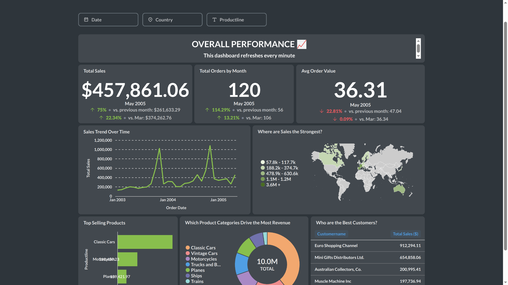

# metabase-sales-dashboard

---

## Tech Stack

- **Python** (pandas, SQLAlchemy, python-dotenv)
- **PostgreSQL** (Docker)
- **Metabase** (Docker)
- **pgAdmin** (optional, for DB management)
- **Docker Compose**

---

## Workflow

1. **Data Cleaning:**  
   Use Python to clean and standardize the raw sales data (see `scripts/load_to_postgres.py`).
2. **Database Load:**  
   Upload the cleaned data to PostgreSQL.
3. **Model Building in Metabase:**  
   Create reusable models (saved SQL queries) for all key business questions.
4. **Dashboarding:**  
   Build interactive charts and dashboards for sales trends, product performance, regional analysis, and more.

---

## Metabase Models

- **Monthly Sales:** Trends over time
- **Top Products:** Highest-selling items
- **Sales by Country:** Regional breakdowns
- **Top Customers:** Most valuable customers

---

## 📊 Dashboard Layout

- **KPIs at the top:** Total sales, average order value, number of orders
- **Main area:** Monthly sales trend, sales by country (bar/map)
- **Lower section:** Top products, product line share, top customers
- **Filters:** Date range, country, product line



---

## 📝 How to Run

1. Copy `.env.example` to `.env` and fill in your own credentials
2. Start all services:
    ```
    docker compose up -d
    ```
3. Clean and upload the data:
    ```
    python3 scripts/load_to_postgres.py
    ```
4. Open Metabase at [http://localhost:3000](http://localhost:3000)  
   Connect to your Postgres database and start exploring!

---

## Portfolio/Client Use

- Easily adaptable for any sales, retail, or e-commerce business
- Models and dashboard can be extended for profit, retention, forecasting, etc.
- Screenshots and GIFs provided for easy sharing or Upwork proposals

---


